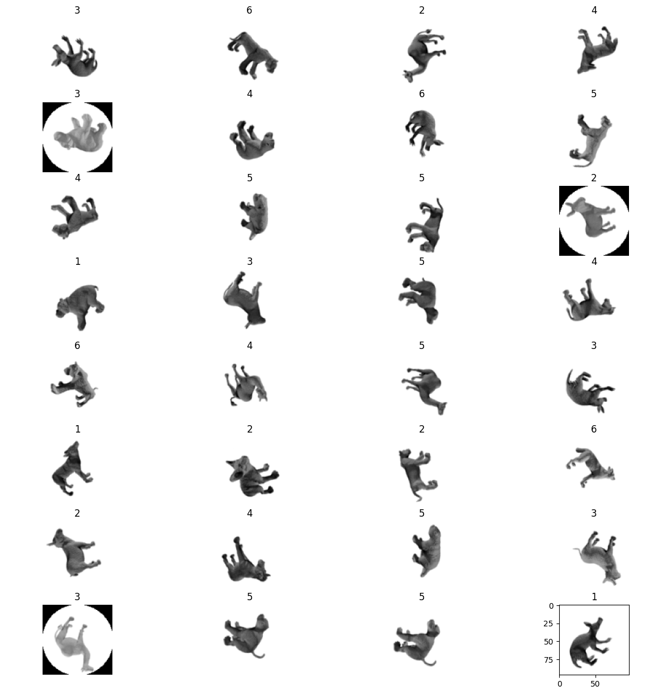

# FunCaptchaAI
Решение задачи RotateCaptcha/FunCaptcha посредством модели нейронной сети

Имеется набор данных с изображениями, представленный в формате пары файлов N.png и N.txt с изображением и ответом соответственно.

**Задача:**
Дано изображение с объектом, который находится в неправильной ориентации. Необходимо найти число x, такое, что если повернуть изображение по часовой стрелке на x*(360/7) градусов, объект встанет в правильную ориентацию. Всего имеется 6 классов ориентации [1-6] 

**Пример данных:**

- Размер тренировочной выборки - 6 000 изображений
- Размер валидационной выборки - 2 000 изображений
- Размер тестовой выборки - 1 000 изображений

**Обучене модели:**
- Epoch 1/10
1200/1200 [==============================] - 23s 18ms/step - loss: 1.7270 - accuracy: 0.2410 - val_loss: 2.6678 - val_accuracy: 0.2085
- Epoch 2/10
1200/1200 [==============================] - 23s 19ms/step - loss: 0.4823 - accuracy: 0.8610 - val_loss: 0.4414 - val_accuracy: 0.8515
- Epoch 3/10
1200/1200 [==============================] - 23s 19ms/step - loss: 0.1179 - accuracy: 0.9678 - val_loss: 0.4446 - val_accuracy: 0.8585
- Epoch 4/10
1200/1200 [==============================] - 23s 19ms/step - loss: 0.0949 - accuracy: 0.9728 - val_loss: 0.3555 - val_accuracy: 0.8735
- Epoch 5/10
1200/1200 [==============================] - 22s 19ms/step - loss: 0.0811 - accuracy: 0.9767 - val_loss: 0.3718 - val_accuracy: 0.8635
- Epoch 6/10
1200/1200 [==============================] - 23s 19ms/step - loss: 0.0653 - accuracy: 0.9793 - val_loss: 0.2102 - val_accuracy: 0.9190
- Epoch 7/10
1200/1200 [==============================] - 23s 19ms/step - loss: 0.0630 - accuracy: 0.9802 - val_loss: 0.2150 - val_accuracy: 0.9310
- Epoch 8/10
1200/1200 [==============================] - 23s 19ms/step - loss: 0.0534 - accuracy: 0.9845 - val_loss: 0.2097 - val_accuracy: 0.9225
- Epoch 9/10
1200/1200 [==============================] - 22s 19ms/step - loss: 0.0512 - accuracy: 0.9832 - val_loss: 0.2834 - val_accuracy: 0.9150
- Epoch 10/10
1200/1200 [==============================] - 22s 19ms/step - loss: 0.0506 - accuracy: 0.9827 - val_loss: 0.1428 - val_accuracy: 0.9470

  Результат тестирования алгоритма:
- F1 Score: 1.0
- Accuracy: 1.0

  В разделе Release приложен набор данных и лучшая модель (веса)
